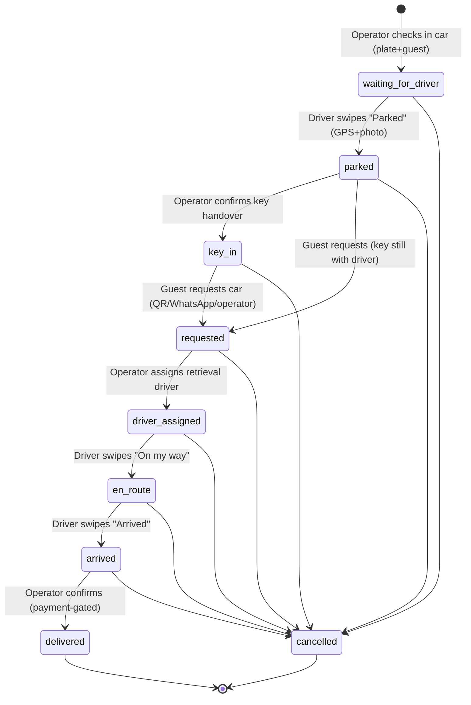
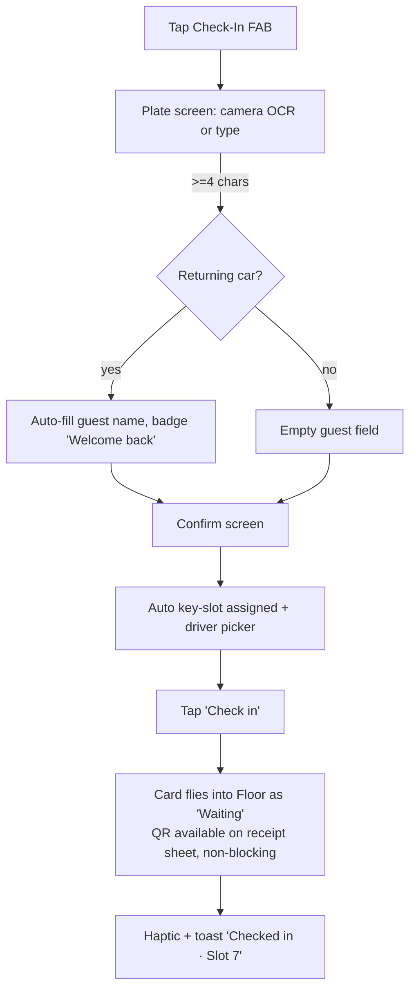
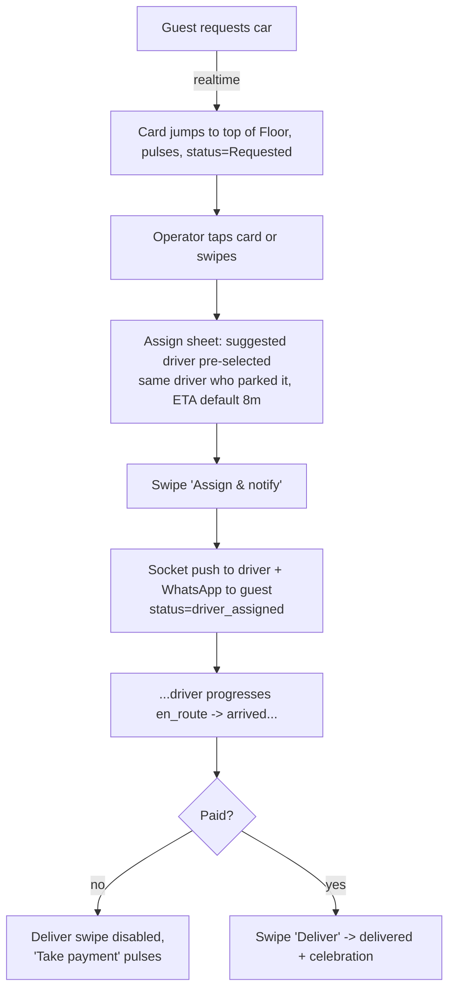
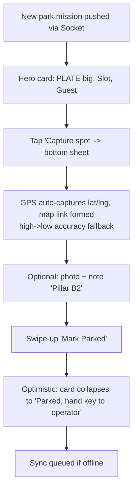
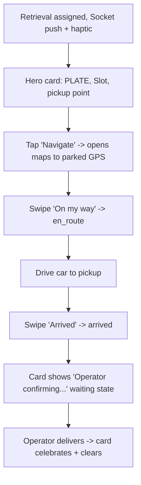
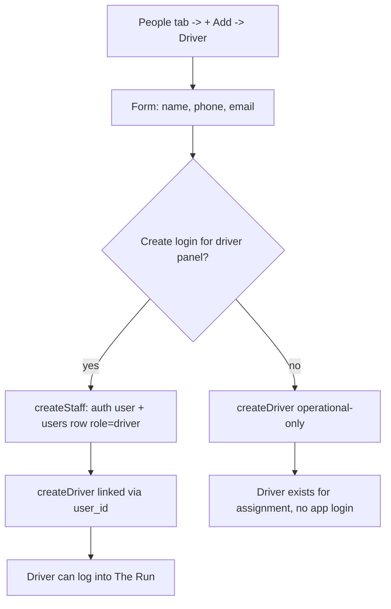
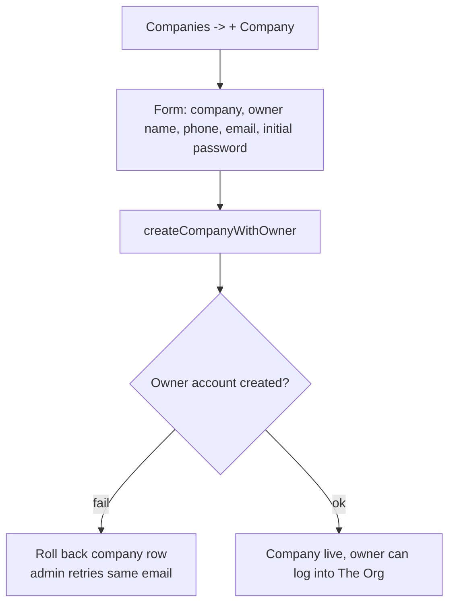
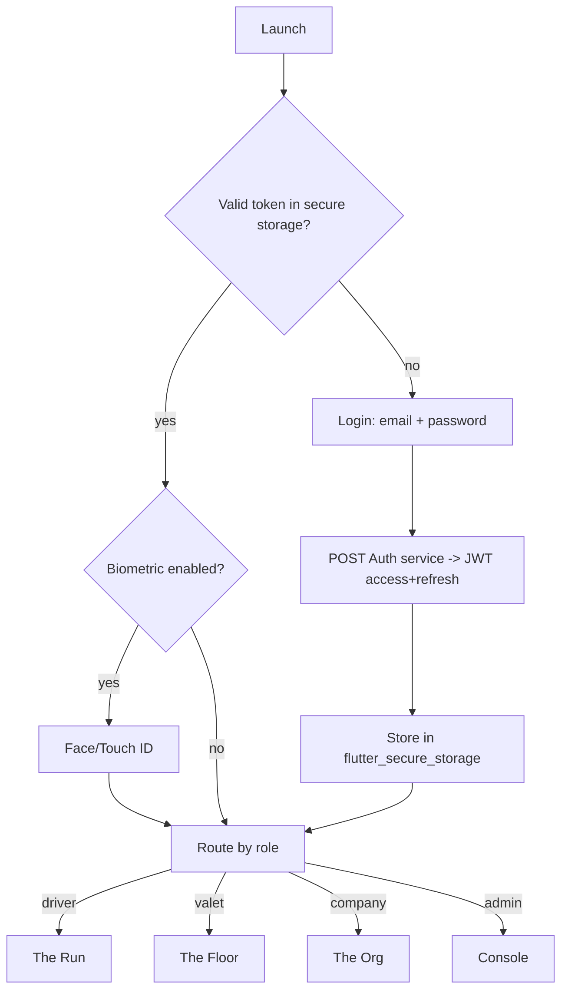

# 04 — User Flows

Mermaid diagrams. The lifecycle preserves the real `STATUS_FLOW` and `LEGAL_TRANSITIONS` (`transactionService.js:9,16`) but redistributes *who* drives each transition to the most natural actor.

---

## 4.1 The canonical valet lifecycle (states preserved, actors clarified)

> Note: this matches `LEGAL_TRANSITIONS` exactly. The redesign does **not** change the machine — it makes each edge a deliberate gesture by the right actor. Payment gate on `arrived → delivered` becomes a *pre-condition that disables the swipe*, not a post-tap toast (fixes audit A11).

---

## 4.2 Operator — Check-In flow (3 taps)

Improvement over old `handleStep1`/`handleStep2`: QR no longer interrupts (audit C1); slot auto-fill kept (`getNextAvailableKeySlot`); returning auto-fill kept (audit C2).

---

## 4.3 Operator — Dispatch / retrieve flow

---

## 4.4 Driver — Park mission

Preserves GPS fallback (`DriverPanel.jsx:148`) and photo/remark capture, but as one sheet step instead of an inline tall form (fixes audit B3).

---

## 4.5 Driver — Retrieve mission

---

## 4.6 Company — add a driver with login (preserves the createStaff link)

Mirrors the real `createStaff` → `createDriver` linkage described in CLAUDE.md so the driver panel resolves by `user_id`, not fuzzy name match.

---

## 4.7 Admin — onboard a company (one shot)

Preserves the rollback-on-failure composed-service pattern (`companyService.createCompanyWithOwner`).

---

## 4.8 Auth flow (mobile-native)

Replaces the web `sessionStorage`/`AuthGate` redirect logic (`App.jsx:70`) with native secure storage + biometric, but keeps the role→home routing table identical.
